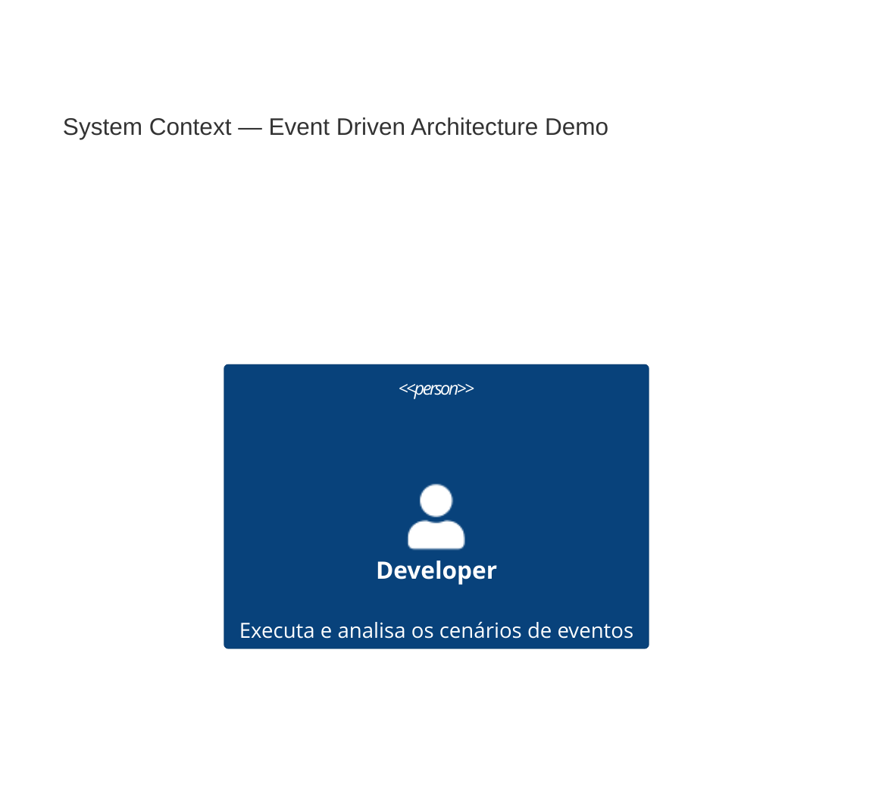
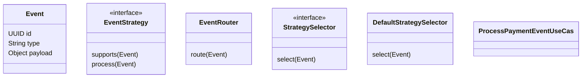

# eventdrivenarchitecture

Multi-module project demonstrating an event-driven architecture in Java/Spring Boot.
The modules are organized as internal libraries that can be split into independent repositories in the future:

- `lib-domain` — Domain definitions and contracts (event models, ports, strategy interfaces).
- `lib-integration` — Integrations and infrastructure adapters (e.g. JPA, persistence helpers, in-memory DB for tests).
- `lib-router` — Event router/strategy selector to dispatch events to appropriate strategies.
- `backend` — Spring Boot application that uses the libraries to demonstrate event processing scenarios.

---

Table of Contents

- Overview
- System Design
- Modules and responsibilities
- How to build
- How to run (development / production)
- Main classes and flow
- CI / CD
- Contributing / Next steps

Overview

This repository is an educational example of structuring an event-driven application into separate modules. The intent is to keep domain contracts and models (`lib-domain`) decoupled from infrastructure and routing implementations so each piece can evolve independently.

System Design

C4 – Level 1: System Context

C4 – Level 2: Container Diagram
```mermaid
C4Container
title Container Diagram — Event Driven Architecture

Person(dev, "Developer")

System(system, "Event Driven Backend",
  "Spring Boot application for event-driven processing")

Container(backend, "backend",
  "Spring Boot",
  "Aplicação principal que executa cenários e orquestra eventos")

Container(libDomain, "lib-domain",
  "Java Library",
  "Modelos de domínio, eventos e contratos")

Container(libRouter, "lib-router",
  "Java Library",
  "Roteamento e seleção de estratégias de eventos")

Container(libIntegration, "lib-integration",
  "Java Library",
  "Infraestrutura e persistência")

Rel(dev, system, "Executa")

Rel(system, backend, "Runs")
Rel(system, libDomain, "Includes")
Rel(system, libRouter, "Includes")
Rel(system, libIntegration, "Includes")

Rel(backend, libDomain, "Usa")
Rel(backend, libRouter, "Usa")
Rel(backend, libIntegration, "Usa")

Rel(libRouter, libDomain, "Depende de")
Rel(libIntegration, libDomain, "Depende de")
```
C4 – Level 3: Component Diagram (Backend + Libs)
```mermaid
C4Component
title Component Diagram — Event Processing Flow

System(system, "Event Driven Backend")

Container(backend, "backend",
  "Spring Boot Application")

Container(libRouter, "lib-router",
  "Routing Library")

Container(libDomain, "lib-domain",
  "Domain Library")

Container(libIntegration, "lib-integration",
  "Integration Library")

Component(startupRunner, "StartupRunner",
  "Adapter In",
  "Dispara cenários de eventos no startup")

Component(processUseCase, "ProcessPaymentEventUseCase",
  "Use Case",
  "Processa eventos de pagamento de forma idempotente")

Component(eventRouter, "EventRouter",
  "Router",
  "Encaminha eventos para estratégias")

Component(strategySelector, "DefaultStrategySelector",
  "Selector",
  "Seleciona EventStrategy compatível")

Component(event, "Event",
  "Domain Model",
  "Evento imutável")

Component(eventStrategy, "EventStrategy",
  "Strategy Contract",
  "Contrato de processamento de eventos")

Component(paymentRepo, "PaymentRepositoryInMemory",
  "Repository",
  "Persistência em memória com versionamento otimista")

Rel(system, backend, "Hosts")
Rel(system, libRouter, "Hosts")
Rel(system, libDomain, "Hosts")
Rel(system, libIntegration, "Hosts")

Rel(backend, startupRunner, "Contains")
Rel(backend, processUseCase, "Contains")

Rel(processUseCase, eventRouter, "Roteia")
Rel(eventRouter, strategySelector, "Seleciona")
Rel(strategySelector, eventStrategy, "Resolve")

Rel(processUseCase, paymentRepo, "Persiste estado")

Rel(libDomain, event, "Define")
Rel(libDomain, eventStrategy, "Define")

Rel(libRouter, eventRouter, "Fornece")
Rel(libIntegration, paymentRepo, "Fornece")

```
C4 – Level 4: Code / Class Diagram



Modules

1. lib-domain
   - Contains: generic models (e.g. `Event`), ports (e.g. `RepositoryPort`) and strategy contracts (`EventStrategy`).
   - Purpose: define the domain core without infra dependencies.
   - Location: `lib-domain/src/main/java/br/com/libdomain`

2. lib-integration
   - Contains: integration helpers and infrastructure code that depend on `lib-domain`.
   - Dependencies: `lib-domain` and Spring Boot starter.
   - Notes: includes JPA and H2 dependencies intended for testing/emulation.
   - Location: `lib-integration`

3. lib-router
   - Contains: event router (`EventRouter`), `StrategySelector` interface and `DefaultStrategySelector` implementation.
   - Purpose: locate and execute `EventStrategy` instances for each `Event`.
   - Location: `lib-router`

4. backend
   - Contains: Spring Boot demonstration application that uses the libraries.
   - Demonstrative behavior: `StartupRunner` runs scenarios that simulate concurrency, event replay, out-of-order events and optimistic-version conflicts.
   - Notes:
     - The application scans packages from `lib-integration` and `libdomain.strategy` to wire strategies and integrations via Spring (see `Application.java` and `IntegrationAutoConfig`).
     - Uses an in-memory repository (`PaymentRepositoryInMemory`) to demonstrate optimistic versioning and idempotency.
   - Location: `backend`

Requirements

- JDK 21 (configured in the parent POM)
- Maven (multi-module build)
- (Optional) Docker, if you want to test external integrations

Build

Build the entire project from the repository root:

```powershell
mvn -T 1C clean install
```

Build only the `backend` module (useful during development):

```powershell
mvn -pl backend -am clean package
```

Running the application (development)

Run the backend via Spring Boot (the application runs demo scenarios on startup):

```powershell
mvn -pl backend spring-boot:run
```

Or run the produced JAR (after `mvn package`):

```powershell
java -jar backend/target/backend-1.0.0-SNAPSHOT.jar
```

The `StartupRunner` inside `backend` will print a sequence of scenarios to the console demonstrating:
- Real concurrency (the same event processed by two threads)
- Idempotent replay of the same event
- Out-of-order event application
- Different concurrent events causing potential optimistic version conflicts

Main classes and flow

- `br.com.libdomain.model.Event` (lib-domain): immutable event structure (UUID, type, payload).
- `br.com.libdomain.strategy.EventStrategy` (lib-domain): contract for strategies that process events.
- `br.com.libdomain.router.EventRouter` (lib-router): routes events to selected strategies.
- `br.com.backend.Application` (backend): Spring Boot entrypoint — note the `scanBasePackages` that includes packages from the libs.
- `br.com.backend.config.RoutingConfig` (backend): builds the `StrategySelector` and `EventRouter` beans.
- `br.com.backend.application.usecases.ProcessPaymentEventUseCase` (backend): applies payment events idempotently.
- `br.com.backend.adapters.out.PaymentRepositoryInMemory` (backend): in-memory repository that simulates optimistic version control.
- `br.com.backend.adapters.in.StartupRunner` (backend): runs demonstration scenarios at startup.

CI / CD

See the CI/CD documentation: `CI_CD.md` for details on how the GitHub Actions workflow is configured and how to trigger and validate CI and CD runs.

Technical notes

- Idempotency is handled at the aggregate (`Payment`) level (it tracks processed event IDs). There's also a simplified version control (`version`) simulated by `PaymentRepositoryInMemory` to illustrate optimistic locking conflicts.
- `EventRouter` requires at least one `EventStrategy` that supports the event; otherwise it throws an exception. In production you may prefer a fallback behavior (silent drop, dead-letter queue, or logging).

Splitting into separate repositories (future work)

Currently the modules are kept in a single monorepo for convenience. When migrating to separate repositories:

- Make each module (`lib-domain`, `lib-integration`, `lib-router`) a separate Git repository with semantic versioning.
- Publish artifacts to a Maven repository (Nexus/Artifactory) or use Git submodules/subtrees depending on your workflow.
- Update `backend` dependencies to point to published versions of the libraries.

Contributing

1. Create a branch with a descriptive name: `feature/description` or `fix/description`.
2. Keep commits small and with clear messages.
3. Open a pull request for review.

License

This repository is an example and does not include an explicit license (add a LICENSE file if you intend to share it publicly).

Contact / Questions

If you want, I can also:
- add a `LICENSE` (suggestions: MIT, Apache-2.0);
- create example unit/integration tests (JUnit + Testcontainers) for the `StartupRunner` scenarios;
- prepare CI scripts (GitHub Actions) for building the multi-module project and publishing artifacts.

Tell me which of the above you'd like next and I'll implement it.

